# Diagrama UML - Scientific Paper Analyzer

## PlantUML Code

```plantuml
@startuml ScientificPaperAnalyzer_ClassDiagram

!define BASIC_COLOR #E3F2FD
!define MODEL_COLOR #FFF3E0
!define IO_COLOR #F3E5F5
!define REPO_COLOR #E8F5E9
!define SERVICE_COLOR #FFF9C4
!define UI_COLOR #FCE4EC
!define UTIL_COLOR #E0F2F1

' ============================================
' PACKAGE: Basic Data Structures
' ============================================
package "basicdatastructures" <<Rectangle>> {
    
    class Entry<K,V> <<BASIC_COLOR>> {
        + key: K
        + value: V
        + next: Entry<K,V>
        --
        + Entry(key: K, value: V)
    }
    
    class Node<T> <<BASIC_COLOR>> {
        - data: T
        - next: Node<T>
        --
        + Node(data: T)
        + getData(): T
        + getNext(): Node<T>
    }
    
    class AVLTreeNode<K,V> <<BASIC_COLOR>> {
        - key: K
        - value: V
        - leftChild: AVLTreeNode<K,V>
        - rightChild: AVLTreeNode<K,V>
        - height: int
        - balanceFactor: int
        --
        + AVLTreeNode(key: K, value: V)
        + getKey(): K
        + getValue(): V
        + setValue(value: V): void
        + getLeftChild(): AVLTreeNode<K,V>
        + getRightChild(): AVLTreeNode<K,V>
        + getHeight(): int
        + getBalanceFactor(): int
    }
    
    class LinkedList<T> <<BASIC_COLOR>> {
        - head: Node<T>
        - tail: Node<T>
        - size: int
        --
        + LinkedList()
        + isEmpty(): boolean
        + add(data: T): void
        + addFirst(data: T): void
        + remove(data: T): void
        + contains(data: T): boolean
        + getSize(): int
        + clear(): void
        + getHead(): Node<T>
        + toString(): String
    }
    
    class HashTable<K,V> <<BASIC_COLOR>> {
        - buckets: Entry<K,V>[]
        - currentCapacity: int
        - elementCount: int
        --
        + HashTable()
        - hash(key: K): int
        - hash(key: K, capacity: int): int
        - requestMemory(): void
        + put(key: K, value: V): void
        + get(key: K): V
        + remove(key: K): void
        + containsKey(key: K): boolean
        + size(): int
        + isEmpty(): boolean
        + getKeys(): LinkedList<K>
    }
    note right of HashTable
        Hash Function: FNV-1a
        Load Factor: 0.75
        Complexity: O(1) average
    end note
    
    class AVLTree<K,V> <<BASIC_COLOR>> {
        - root: AVLTreeNode<K,V>
        - size: int
        --
        + AVLTree()
        + size(): int
        + isEmpty(): boolean
        - getHeight(node: AVLTreeNode): int
        + getHeight(): int
        - updateHeight(node: AVLTreeNode): void
        - updateBalanceFactor(node: AVLTreeNode): void
        - updateNode(node: AVLTreeNode): void
        - rotateRight(node: AVLTreeNode): AVLTreeNode
        - rotateLeft(node: AVLTreeNode): AVLTreeNode
        - rotateLeftRight(node: AVLTreeNode): AVLTreeNode
        - rotateRightLeft(node: AVLTreeNode): AVLTreeNode
        + insert(key: K, value: V): void
        - insert(node: AVLTreeNode, key: K, value: V): AVLTreeNode
        + search(key: K): V
        - search(node: AVLTreeNode, key: K): V
        + contains(key: K): boolean
        + inorderTraversal(): LinkedList<K>
        - inorderTraversal(node: AVLTreeNode, result: LinkedList): void
        + getAllEntries(): LinkedList<Entry<K,V>>
        - getAllEntries(node: AVLTreeNode, result: LinkedList): void
        + clear(): void
    }
    note right of AVLTree
        Self-balancing BST
        Balance Factor: [-1, 0, 1]
        Complexity: O(log n)
    end note
}

' Relationships in basicdatastructures
LinkedList *-- Node : contains
HashTable *-- Entry : contains
AVLTree *-- AVLTreeNode : contains

' ============================================
' PACKAGE: Models
' ============================================
package "models" <<Rectangle>> {
    
    class Summary <<MODEL_COLOR>> {
        - title: String
        - authors: LinkedList<String>
        - body: String
        - keywords: LinkedList<String>
        --
        + Summary(title: String, authors: LinkedList, \n  body: String, keywords: LinkedList)
        + getTitle(): String
        + getAuthors(): LinkedList<String>
        + getBody(): String
        + getKeywords(): LinkedList<String>
        + toString(): String
        + equals(obj: Object): boolean
        + hashCode(): int
    }
    note right of Summary
        Immutable class
        equals() uses Collator (ES)
        Validates nulls/empty
    end note
    
    class AnalysisResult <<MODEL_COLOR>> {
        - title: String {final}
        - authors: LinkedList<String> {final}
        - keywordFrequencies: HashTable<String, Integer> {final}
        --
        + AnalysisResult(title: String, authors: LinkedList, \n  frequencies: HashTable)
        + getTitle(): String
        + getAuthors(): LinkedList<String>
        + getKeywordFrequencies(): HashTable<String, Integer>
    }
    note right of AnalysisResult
        DTO - Immutable
        Used for Req 2c
    end note
    
    class KeywordDetails <<MODEL_COLOR>> {
        - keyword: String {final}
        - frequency: int {final}
        - summaries: LinkedList<Summary> {final}
        --
        + KeywordDetails(keyword: String, frequency: int, \n  summaries: LinkedList)
        + getKeyword(): String
        + getFrequency(): int
        + getSummaries(): LinkedList<Summary>
    }
    note right of KeywordDetails
        DTO - Immutable
        Used for Req 5
    end note
}

' Relationships in models
Summary o-- LinkedList
AnalysisResult o-- LinkedList
AnalysisResult o-- HashTable
KeywordDetails o-- LinkedList

' ============================================
' PACKAGE: I/O
' ============================================
package "io" <<Rectangle>> {
    
    class FileIO <<IO_COLOR>> {
        --
        + {static} readFile(filepath: String): LinkedList<String>
        + {static} writeFile(filepath: String, lines: LinkedList): void
    }
    note right of FileIO
        Utility class
        BufferedReader/Writer
    end note
    
    class SummaryParser <<IO_COLOR>> {
        --
        + {static} parseFromFile(filepath: String): Summary
        + {static} saveToFile(summary: Summary, filepath: String): void
    }
    note right of SummaryParser
        Formato Anexo 1
        Parsea: Título, Autores,
        Resumen, Palabras claves
    end note
}

' Relationships in io
SummaryParser ..> FileIO : uses
SummaryParser ..> Summary : creates
SummaryParser ..> LinkedList : uses

' ============================================
' PACKAGE: Repositories
' ============================================
package "repositories" <<Rectangle>> {
    
    class SummaryRecord <<REPO_COLOR>> {
        - summary: Summary
        - filepath: String
        --
        + SummaryRecord(summary: Summary, filepath: String)
        + getSummary(): Summary
        + getFilepath(): String
        + toString(): String
    }
    
    class Repository <<REPO_COLOR>> {
        - summariesTable: HashTable<String, SummaryRecord>
        - authorsAVL: AVLTree<String, LinkedList<Summary>>
        - keywordsAVL: AVLTree<String, LinkedList<Summary>>
        - authorOriginalNames: HashTable<String, String>
        - keywordOriginalNames: HashTable<String, String>
        - dataDirectory: String
        --
        + Repository(dataDirectory: String)
        - normalizeKey(text: String): String
        + loadAll(): int
        + add(sourceFilepath: String): Summary
        + findByTitle(title: String): Summary
        + containsTitle(title: String): boolean
        + getAllTitlesSorted(): LinkedList<String>
        + getAllSummaries(): LinkedList<Summary>
        + getSummaryCount(): int
        + getSummariesByAuthor(author: String): LinkedList<Summary>
        + getAllAuthorsSorted(): LinkedList<String>
        + getAuthorCount(): int
        + getSummariesByKeyword(keyword: String): LinkedList<Summary>
        + getAllKeywordsSorted(): LinkedList<String>
        + getKeywordCount(): int
        + getKeywordFrequency(keyword: String): int
        - indexByAuthors(summary: Summary): void
        - indexByKeywords(summary: Summary): void
        + isEmpty(): boolean
    }
    note right of Repository
        Central Coordinator
        Triple Indexing:
        - HashTable (titles) O(1)
        - AVL (authors) O(log n)
        - AVL (keywords) O(log n)
        
        Normalization: NFD
        lowercase + no accents
    end note
}

' Relationships in repositories
Repository *-- HashTable : summariesTable
Repository *-- AVLTree : authorsAVL
Repository *-- AVLTree : keywordsAVL
Repository *-- HashTable : authorOriginalNames
Repository *-- HashTable : keywordOriginalNames
Repository ..> SummaryRecord : uses
Repository ..> Summary : uses
Repository ..> SummaryParser : uses
Repository ..> MergeSort : uses
SummaryRecord o-- Summary

' ============================================
' PACKAGE: Services
' ============================================
package "services" <<Rectangle>> {
    
    class SummaryService <<SERVICE_COLOR>> {
        - repository: Repository
        --
        + SummaryService(repository: Repository)
        + addSummary(filepath: String): Summary
        + summaryExists(title: String): boolean
        + getSummaryByTitle(title: String): Summary
        + getAllTitlesSorted(): LinkedList<String>
        + getAllSummaries(): LinkedList<Summary>
        + getSummaryCount(): int
        + isEmpty(): boolean
        + loadAllSummaries(): int
    }
    note right of SummaryService
        Req 1, 2a, 2b
    end note
    
    class AnalysisService <<SERVICE_COLOR>> {
        - repository: Repository
        --
        + AnalysisService(repository: Repository)
        + analyzeKeywordFrequencies(summary: Summary): AnalysisResult
        + analyzeByTitle(title: String): AnalysisResult
        - normalizeText(text: String): String
        - countOccurrences(text: String, keyword: String): int
    }
    note right of AnalysisService
        Req 2c
        Word boundary matching
    end note
    
    class SearchService <<SERVICE_COLOR>> {
        - repository: Repository
        --
        + SearchService(repository: Repository)
        + searchByKeyword(keyword: String): LinkedList<Summary>
        + searchByAuthor(author: String): LinkedList<Summary>
        + getAllAuthorsSorted(): LinkedList<String>
        + getAuthorCount(): int
        + authorExists(author: String): boolean
        + keywordExists(keyword: String): boolean
    }
    note right of SearchService
        Req 3, 4
    end note
    
    class KeywordService <<SERVICE_COLOR>> {
        - repository: Repository
        --
        + KeywordService(repository: Repository)
        + getAllKeywordsSorted(): LinkedList<String>
        + getKeywordDetails(keyword: String): KeywordDetails
        + getKeywordCount(): int
        + getKeywordFrequency(keyword: String): int
        + keywordExists(keyword: String): boolean
    }
    note right of KeywordService
        Req 5
    end note
}

' Relationships in services
SummaryService o-- Repository
AnalysisService o-- Repository
SearchService o-- Repository
KeywordService o-- Repository
AnalysisService ..> AnalysisResult : creates
KeywordService ..> KeywordDetails : creates

' ============================================
' PACKAGE: Utils
' ============================================
package "utils" <<Rectangle>> {
    
    class MergeSort <<UTIL_COLOR>> {
        - {static} SPANISH_COLLATOR: Collator
        --
        + {static} sort(array: String[]): void
        + {static} sort(list: LinkedList<String>): LinkedList<String>
        - {static} mergeSort(array: String[], temp: String[], \n  left: int, right: int): void
        - {static} merge(array: String[], temp: String[], \n  left: int, mid: int, right: int): void
    }
    note right of MergeSort
        O(n log n)
        Spanish Collation
        Divide & Conquer
    end note
}

' ============================================
' PACKAGE: UI
' ============================================
package "ui" <<Rectangle>> {
    
    class MainFrame <<UI_COLOR>> {
        - logger: Logger
        - summaryService: SummaryService
        - analysisService: AnalysisService
        - searchService: SearchService
        - keywordService: KeywordService
        --
        + MainFrame(sumService: SummaryService, \n  anaService: AnalysisService, \n  seaService: SearchService, \n  keyService: KeywordService)
        - resetAddSummaryPanel(): void
        - loadAnalyzeTitles(): void
        - loadSearchKeywords(): void
        - loadSearchAuthors(): void
        - loadListKeywords(): void
        - setupSearchKeywordTableListener(): void
        - setupSearchAuthorTableListener(): void
        - setupListKeywordTableListener(): void
        - showSummaryDetailsFromSearch(rowIndex: int): void
        - showSummaryDetailsFromSearchAuthor(rowIndex: int): void
        - showKeywordDetails(rowIndex: int): void
        - addSummarySelectFileButtonActionPerformed(evt): void
        - addSummaryConfirmButtonActionPerformed(evt): void
        - AnalyzeButtonActionPerformed(evt): void
        - searchKeywordButtonActionPerformed(evt): void
        - searchAuthorButtonActionPerformed(evt): void
    }
    note right of MainFrame
        JFrame - Swing GUI
        5 functional tabs:
        1. Agregar Resumen
        2. Analizar Resumen
        3. Buscar Keyword
        4. Buscar Autor
        5. Listar Keywords
    end note
}

' Relationships in ui
MainFrame o-- SummaryService
MainFrame o-- AnalysisService
MainFrame o-- SearchService
MainFrame o-- KeywordService

' ============================================
' PACKAGE: Main
' ============================================
package "com.graph.scientificpaperanalyzer" <<Rectangle>> {
    
    class ScientificPaperAnalyzer {
        --
        + {static} main(args: String[]): void
    }
    note right of ScientificPaperAnalyzer
        Entry Point
        Dependency Injection
        Initializes:
        - Repository
        - 4 Services
        - MainFrame
    end note
}

' Relationships with main
ScientificPaperAnalyzer ..> Repository : creates
ScientificPaperAnalyzer ..> SummaryService : creates
ScientificPaperAnalyzer ..> AnalysisService : creates
ScientificPaperAnalyzer ..> SearchService : creates
ScientificPaperAnalyzer ..> KeywordService : creates
ScientificPaperAnalyzer ..> MainFrame : creates

' ============================================
' LAYERED ARCHITECTURE NOTES
' ============================================
note as ArchitectureNote
    **Arquitectura en Capas**
    
    Main Layer (ScientificPaperAnalyzer)
           ↓
    UI Layer (MainFrame)
           ↓
    Services Layer (4 Services)
           ↓
    Repository Layer (Repository)
           ↓
    Data Structures Layer (HashTable, AVL, LinkedList)
    
    **Características:**
    - Inyección de dependencias
    - Separación de responsabilidades
    - Normalización de keys (NFD)
    - DTOs inmutables
    - Complejidades optimizadas
end note

@enduml
```



## Notas Adicionales

### Complejidades por Operación

| Operación | Complejidad | Estructura Usada |
|-----------|-------------|------------------|
| Agregar resumen | O(log n) | AVL insert |
| Buscar por título | O(1) | HashTable |
| Buscar por keyword | O(log n) | AVL search |
| Buscar por autor | O(log n) | AVL search |
| Listar títulos ordenados | O(n log n) | MergeSort |
| Listar keywords ordenadas | O(n) | AVL inorder |
| Listar autores ordenados | O(n) | AVL inorder |
| Analizar frecuencias | O(k·m) | k=keywords, m=body length |

### Características Clave

1. **Triple Indexación**:
   - HashTable para títulos (O(1))
   - AVL para autores (O(log n))
   - AVL para keywords (O(log n))

2. **Normalización de Claves**:
   - NFD decomposition
   - Lowercase + sin acentos
   - Nombres originales preservados

3. **Función Hash**:
   - FNV-1a (Fowler-Noll-Vo)
   - Load factor: 0.75
   - Resize automático

4. **AVL Tree**:
   - Balance factor: [-1, 0, 1]
   - 4 tipos de rotaciones (LL, RR, LR, RL)
   - Altura almacenada (O(1) access)

5. **Ordenamiento**:
   - MergeSort O(n log n)
   - Collator español (PRIMARY)
   - Manejo correcto de acentos

### Mapeo de Requerimientos

| Req | Descripción | Implementación |
|-----|-------------|----------------|
| 1 | Agregar resumen | SummaryService.addSummary() |
| 2a | Lista de títulos | SummaryService.getAllTitlesSorted() |
| 2b | Buscar por título | SummaryService.getSummaryByTitle() |
| 2c | Analizar frecuencias | AnalysisService.analyzeKeywordFrequencies() |
| 3 | Buscar por keyword | SearchService.searchByKeyword() |
| 4 | Buscar por autor | SearchService.searchByAuthor() |
| 5 | Listar keywords | KeywordService.getAllKeywordsSorted() |
| 5 | Detalles keyword | KeywordService.getKeywordDetails() |

---

## Cómo usar este UML

1. **Online**: Copia el código PlantUML en [PlantText](https://www.planttext.com/) o [PlantUML Online Server](http://www.plantuml.com/plantuml/uml/)

2. **VS Code**: Instala la extensión "PlantUML" y visualiza el archivo

3. **IntelliJ IDEA**: Instala el plugin "PlantUML integration"

4. **CLI**: 
```bash
# Instalar PlantUML
brew install plantuml

# Generar imagen
plantuml UML.md
```

## Leyenda de Colores

- 🔵 **BASIC_COLOR** (#E3F2FD): Estructuras de datos básicas
- 🟠 **MODEL_COLOR** (#FFF3E0): Modelos de dominio
- 🟣 **IO_COLOR** (#F3E5F5): Entrada/Salida
- 🟢 **REPO_COLOR** (#E8F5E9): Repositorios
- 🟡 **SERVICE_COLOR** (#FFF9C4): Servicios
- 🔴 **UI_COLOR** (#FCE4EC): Interfaz de usuario
- 🔷 **UTIL_COLOR** (#E0F2F1): Utilidades
